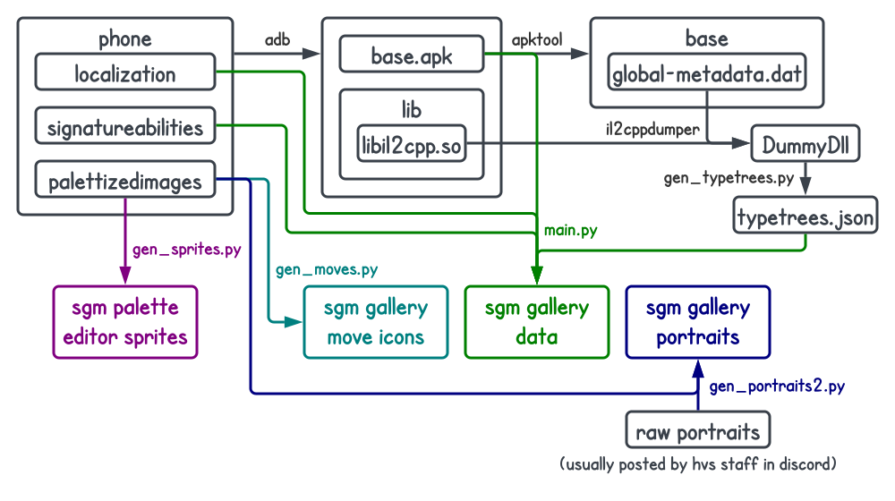

# SGM Processor

This repository houses the scripts for extracting resources used in my other Skullgirls Mobile projects (i.e. [SGM Gallery](https://github.com/Krazete/sgm) and [SGM Palette Editor](https://github.com/Krazete/sgmpalette)).

This diagram shows the process of updating the Gallery and Palette Editor. For more details, see [INSTRUCTIONS.md](INSTRUCTIONS.md).